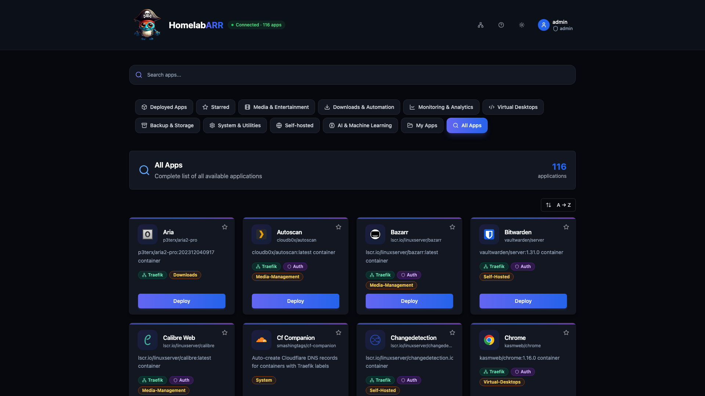
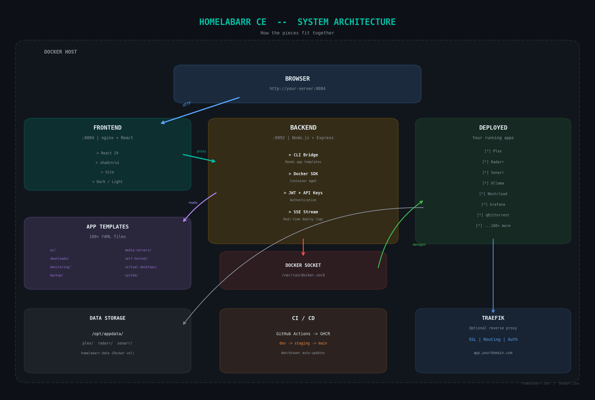
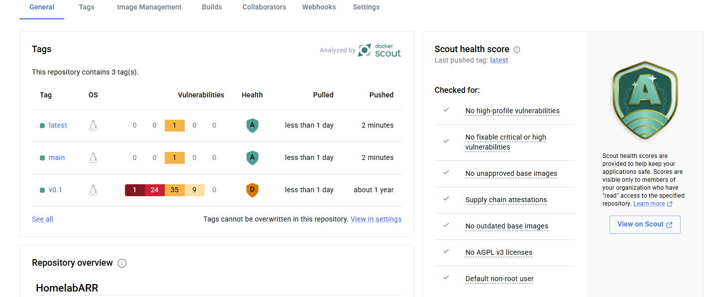

# HomelabARR CE

<p align="center">
    <a href="https://github.com/smashingtags/homelabarr-ce">
      
    </a>
</p>

<p align="center"><strong>Your homelab, one dashboard.</strong></p>

<p align="center">
    <a href="https://github.com/smashingtags/homelabarr-ce/releases/latest">
        
    </a>
    <a href="https://github.com/smashingtags/homelabarr-ce/blob/main/LICENSE">
        
    </a>
    <a href="https://discord.gg/Pc7mXX786x">
        
    </a>
    <a href="https://wiki.homelabarr.com">
        
    </a>
    <a href="https://www.reddit.com/r/homelabarr/">
        
    </a>
</p>

<p align="center">
    <a href="https://github.com/smashingtags/homelabarr-ce/actions/workflows/github-code-scanning/codeql">
        
    </a>
    <a href="https://snyk.io/test/github/smashingtags/homelabarr-ce">
        
    </a>
</p>

<p align="center">
    <a href="https://ce-demo.homelabarr.com">
        
    </a>
    <a href="https://homelabarr.com">
        
    </a>
    <a href="https://imogenlabs.ai">
        
    </a>
</p>

---

## What is this?

HomelabARR CE is a free, open-source dashboard for deploying Docker containers on your homelab. Pick an app from the catalog, click Deploy, and it's running. No more copy-pasting Docker Compose files.

**100+ app templates** across 11 categories — Plex, Sonarr, Radarr, Jellyfin, Ollama, Home Assistant, qBittorrent, and a lot more.

<p align="center">
    
</p>

---

## Quick Start

### Clone the repo

```bash
git clone https://github.com/smashingtags/homelabarr-ce.git /opt/homelabarr
cd /opt/homelabarr
```

### Option 1: Pre-built Images (fastest)

```bash
export JWT_SECRET=$(openssl rand -base64 32)
export DOCKER_GID=$(getent group docker | cut -d: -f3)
export CORS_ORIGIN=http://$(hostname -I | awk '{print $1}'):8084

docker compose -f homelabarr.yml up -d
```

### Option 2: Build from Source

```bash
cp .env.example .env    # Edit with your settings

docker build -t homelabarr-frontend:local -f Dockerfile .
docker build -t homelabarr-backend:local -f Dockerfile.backend .

# Edit homelabarr.yml — change GHCR images to :local tags
export JWT_SECRET=$(openssl rand -base64 32)
export DOCKER_GID=$(getent group docker | cut -d: -f3)
export CORS_ORIGIN=http://$(hostname -I | awk '{print $1}'):8084

docker compose -f homelabarr.yml up -d
```

**Dashboard:** `http://your-server:8084`  
**Login:** `admin` / `admin` — **change this immediately**

> ⚠️ **Proxmox LXC users:** If containers won't start, add `lxc.apparmor.profile: unconfined` to your LXC config and reboot the container.

Full install guide: [wiki.homelabarr.com/guides/quick-start](https://wiki.homelabarr.com/guides/quick-start/)

---

## Requirements

- Docker + Docker Compose v2
- Linux (Debian/Ubuntu recommended — also works on Proxmox LXC, Unraid, Synology, Raspberry Pi)
- 2 CPU cores, 4 GB RAM, 20 GB disk
- Works on **x86_64 and ARM64** (multi-arch images)

---

## Features

- **100+ app templates across 11 categories** — Media, Downloads, Monitoring, AI & ML, Virtual Desktops, and more
- **One-click deploy** — pick an app, click the button, it's running
- **Three deployment modes** — Standard (IP:port), Traefik (reverse proxy + SSL), Traefik + Authelia (reverse proxy + 2FA)
- **Container management** — start, stop, restart, remove, view logs from the dashboard
- **Port Manager** — see every port in use, catch conflicts before they happen
- **Custom app templates** — drop a YAML file in `apps/myapps/` and it shows up in the catalog
- **JWT + API key auth** — secure your dashboard, generate API keys for automation
- **Dark mode** — it looks good
- **Mobile app** — iOS and Android (HomelabARR Mobile on App Store / Google Play)
- **CLI tool** — deploy and manage from the terminal if that's your thing

---

## App Categories

| Category | Count | Examples |
|----------|-------|---------|
| AI & Machine Learning | 14 | Ollama, Open WebUI, ComfyUI, Stable Diffusion, LocalAI |
| Media Servers | 5 | Plex, Jellyfin, Emby |
| Media Management | 16 | Sonarr, Radarr, Lidarr, Bazarr, Prowlarr, Recyclarr |
| Downloads | 14 | qBittorrent, SABnzbd, NZBGet, Deluge, Transmission |
| Monitoring | 9 | Grafana, Netdata, Uptime Kuma, Tautulli, Prometheus |
| Self-hosted | 37 | Nextcloud, Vaultwarden, Immich, Home Assistant, n8n, Ghost |
| System | 13 | Portainer, Dozzle, Watchtower, Traefik, CF Companion |
| Virtual Desktops | 10 | Kasm Workspaces, Firefox, Chrome, Tor Browser |
| Transcoding | 5 | Tdarr, Handbrake, MakeMKV |
| Backup | 3 | Duplicati, Restic |
| My Apps | — | Your custom templates |

Templates live in `apps/<category>/`. Each one is a Docker Compose YAML with variable placeholders that get filled in when you deploy.

---

## Architecture

| Component | Stack | Port |
|-----------|-------|------|
| Frontend | React 18 + Vite + TailwindCSS + shadcn/ui | 8084 (nginx) |
| Backend | Node.js + Express + Dockerode | 8092 |
| Auth | JWT + bcrypt + API keys (hlr_ prefix) | — |

The frontend is a static React app served by nginx. It proxies `/api` requests to the backend. The backend reads app templates from the `apps/` directory and talks to the Docker socket to manage containers.

<p align="center">
    
</p>

---

## Configuration

| Variable | Required | Description |
|----------|----------|-------------|
| `JWT_SECRET` | ✅ | Secret for signing auth tokens |
| `DOCKER_GID` | ✅ | Your host's docker group ID (`getent group docker \| cut -d: -f3`) |
| `CORS_ORIGIN` | ✅ | URL you access the dashboard from (e.g., `http://192.168.1.50:8084`) |
| `DEFAULT_ADMIN_PASSWORD` | No | Initial admin password (default: `admin`) |
| `TZ` | No | Timezone (default: `America/New_York`) |
| `LOG_LEVEL` | No | `info`, `debug`, `error` |

Full config reference: [wiki.homelabarr.com/guides/configuration](https://wiki.homelabarr.com/guides/configuration/)

---

## Development

```bash
npm install
npm run dev       # Vite on :5173 + Express on :8092
npm run build     # Build frontend
npm test          # Vitest
```

---

## Security

| Tool | What it scans | When |
|------|--------------|------|
| [CodeQL](https://github.com/smashingtags/homelabarr-ce/security/code-scanning) | JS/TS source — SSRF, injection, XSS | Every push |
| [Snyk](https://snyk.io/test/github/smashingtags/homelabarr-ce) | npm deps + Docker base images | Continuous |
| [Dependabot](https://github.com/smashingtags/homelabarr-ce/security/dependabot) | Outdated deps with known CVEs | Automatic PRs |
| [Docker Scout](https://hub.docker.com/r/smashingtags/homelabarr-frontend) | Container images, SBOMs, attestations | Every push |

<p align="center">
    
</p>
<p align="center"><em>Frontend — Scout Score A</em></p>

We run non-root containers, Helmet security headers, rate limiting, CORS validation, path sanitization, `crypto.randomBytes` for session IDs, and SLSA provenance + SBOM attestations on every build.

Report vulnerabilities privately: **michael@mjashley.com** — see [SECURITY.md](SECURITY.md).

---

## Professional Edition

Looking for storage management (SnapRAID + MergerFS), cache mover, file sharing, and system monitoring? Check out [HomelabARR PE](https://homelabarr.com#pricing).

---

## Contributing

See [CONTRIBUTING.md](.github/CONTRIBUTING.md).

---

## Links

- **Website:** [homelabarr.com](https://homelabarr.com)
- **Wiki:** [wiki.homelabarr.com](https://wiki.homelabarr.com)
- **Demo:** [ce-demo.homelabarr.com](https://ce-demo.homelabarr.com) (admin / admin)
- **Discord:** [discord.gg/Pc7mXX786x](https://discord.gg/Pc7mXX786x)
- **Reddit:** [r/homelabarr](https://www.reddit.com/r/homelabarr/)
- **Company:** [imogenlabs.ai](https://imogenlabs.ai)
- **Author:** [mjashley.com](https://mjashley.com)

---

## Contributors

<table>
<tr>
    <td align="center"><a href="https://github.com/smashingtags"><br /><sub><b>smashingtags</b></sub></a></td>
    <td align="center"><a href="https://github.com/fscorrupt"><br /><sub><b>FSCorrupt</b></sub></a></td>
    <td align="center"><a href="https://github.com/drag0n141"><br /><sub><b>DrAg0n141</b></sub></a></td>
    <td align="center"><a href="https://github.com/aelfa"><br /><sub><b>Aelfa</b></sub></a></td>
    <td align="center"><a href="https://github.com/cyb3rgh05t"><br /><sub><b>cyb3rgh05t</b></sub></a></td>
    <td align="center"><a href="https://github.com/justinglock40"><br /><sub><b>justinglock40</b></sub></a></td>
    <td align="center"><a href="https://github.com/mrfret"><br /><sub><b>mrfret</b></sub></a></td>
</tr>
<tr>
    <td align="center"><a href="https://github.com/dan3805"><br /><sub><b>DoCtEuR3805</b></sub></a></td>
    <td align="center"><a href="https://github.com/brtbach"><br /><sub><b>brtbach</b></sub></a></td>
    <td align="center"><a href="https://github.com/ramsaytc"><br /><sub><b>ramsaytc</b></sub></a></td>
    <td align="center"><a href="https://github.com/Shayne55434"><br /><sub><b>Shayne</b></sub></a></td>
    <td align="center"><a href="https://github.com/Nossersvinet"><br /><sub><b>Nossersvinet</b></sub></a></td>
    <td align="center"><a href="https://github.com/ookla-ariel-ride"><br /><sub><b>Ookla, Ariel, Ride!</b></sub></a></td>
</tr>
<tr>
    <td align="center"><a href="https://github.com/townsmcp"><br /><sub><b>James Townsend</b></sub></a></td>
    <td align="center"><a href="https://github.com/red-daut"><br /><sub><b>Red Daut</b></sub></a></td>
    <td align="center"><a href="https://github.com/DomesticWarlord"><br /><sub><b>DomesticWarlord</b></sub></a></td>
</tr>
</table>

## License

[MIT](LICENSE) — free to use, modify, and distribute.
