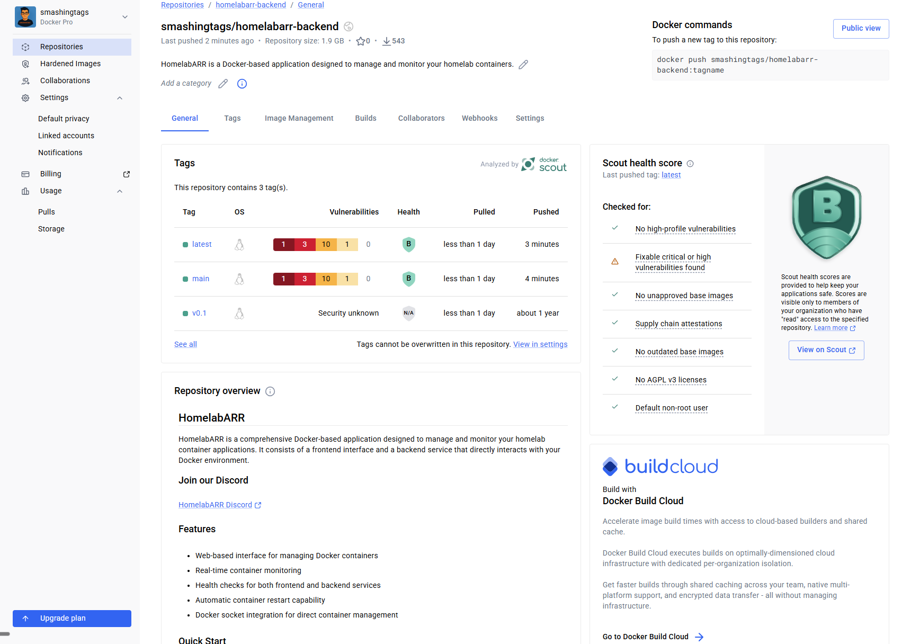

# HomelabARR CE

<p align="center">
    <a href="https://github.com/smashingtags/homelabarr-ce">
      
    </a>
</p>

<p align="center">
    <a href="https://discord.gg/Pc7mXX786x">
        
    </a>
    <a href="https://github.com/smashingtags/homelabarr-ce/releases/latest">
        
    </a>
    <a href="https://github.com/smashingtags/homelabarr-ce/blob/main/LICENSE">
        
    </a>
    <a href="https://ko-fi.com/homelabarr">
        
    </a>
    <a href="https://smashingtags.github.io/homelabarr-ce/">
        
    </a>
    <a href="https://www.reddit.com/r/homelabarr/">
        
    </a>
</p>

<p align="center">
    <a href="https://github.com/smashingtags/homelabarr-ce/actions/workflows/github-code-scanning/codeql">
        
    </a>
    <a href="https://snyk.io/test/github/smashingtags/homelabarr-ce">
        
    </a>
    <a href="https://github.com/smashingtags/homelabarr-ce/security">
        
    </a>
</p>

<p align="center">
    <a href="https://ce-demo.homelabarr.com">
        
    </a>
    <a href="https://demo.homelabarr.com">
        
    </a>
    <a href="https://homelabarr.com">
        
    </a>
    <a href="https://imogenlabs.ai">
        
    </a>
    <a href="https://mjashley.com">
        
    </a>
</p>

**GUI-driven Docker container management for homelabbers.** Deploy and manage 123+ self-hosted apps from a single dashboard — no more copy-pasting Docker Compose files.

---

## What is HomelabARR?

HomelabARR CE is a free, open-source web UI for deploying and managing Docker containers on your homelab. Pick an app from the catalog, click deploy, and it's running. Supports Plex, Sonarr, Radarr, Jellyfin, Home Assistant, Immich, and 100+ more.

Two deployment modes:
- **Docker Compose** (recommended) — pull pre-built images and run
- **Local Mode** — clone the repo and deploy individual app templates via shell scripts

---

## Quick Start

### Option 1: Pre-built Images (fastest)

Pull the official images from GitHub Container Registry — no build step needed.

```bash
# Download the compose file
curl -o docker-compose.yml https://raw.githubusercontent.com/smashingtags/homelabarr-ce/main/homelabarr.yml

# Set required environment
export JWT_SECRET=$(openssl rand -base64 32)
export DOCKER_GID=$(getent group docker | cut -d: -f3)
export CORS_ORIGIN=http://$(hostname -I | awk '{print $1}'):8084

# Deploy
docker compose up -d
```

The UI is at `http://your-server:8084`. Log in with **admin / admin**. Change the password immediately.

### Option 2: Build From Source

Clone the repo and build the Docker images yourself. This lets you modify the code, customize templates, or contribute changes.

```bash
git clone https://github.com/smashingtags/homelabarr-ce.git
cd homelabarr-ce
cp .env.example .env    # Edit with your settings

# Build both images locally
docker build -t homelabarr-frontend:local -f Dockerfile .
docker build -t homelabarr-backend:local -f Dockerfile.backend .

# Update homelabarr.yml to use your local images instead of GHCR
# Change image: ghcr.io/smashingtags/homelabarr-frontend:latest → homelabarr-frontend:local
# Change image: ghcr.io/smashingtags/homelabarr-backend:latest  → homelabarr-backend:local

# Deploy
export JWT_SECRET=$(openssl rand -base64 32)
export DOCKER_GID=$(getent group docker | cut -d: -f3)
export CORS_ORIGIN=http://$(hostname -I | awk '{print $1}'):8084
docker compose -f homelabarr.yml up -d
```

> **Tip:** Building from source takes 2-3 minutes. The pre-built images are identical to what the CI builds from `main`.

---

## Requirements

- Docker + Docker Compose v2
- Linux (Debian/Ubuntu recommended — also works on Proxmox, Unraid, Synology, TrueNAS)
- 2 CPU cores, 4GB RAM, 20GB disk minimum

---

## Features

- **123+ app templates across 11 categories (including AI & ML)** — Plex, Sonarr, Radarr, Jellyfin, qBittorrent, Overseerr, Grafana, and more
- **One-click deployment** — select an app, hit deploy
- **Automatic Cloudflare DNS** — deploy a container, DNS record appears. No more manual CNAMEs. Powered by [CF Companion](https://github.com/smashingtags/cf-companion)
- **Container management** — start, stop, restart, remove from the UI
- **Health monitoring** — see container status at a glance
- **Template-based** — Docker Compose generation from YAML templates
- **Two modes** — Full Mode (Traefik + domain + SSL + auto DNS) or Local Mode (direct IP:PORT)
- **Traefik + Authelia + CF Companion** — reverse proxy, 2FA, and auto DNS all deploy as one stack
- **JWT authentication** — secure your dashboard
- **Premium dark mode** — gradient backgrounds, card depth, noise overlays
- **14 AI & ML apps** — Ollama, Open WebUI, ComfyUI, Stable Diffusion, and more with GPU configs
- **166 app icons** — every active app has a real logo
- **Alphabetical sorting** — A→Z / Z→A toggle on all views
- **shadcn/ui components** — modern, accessible, consistent design

---

## Architecture

| Component | Tech | Port |
|-----------|------|------|
| Frontend | React 18 + TypeScript + Vite + TailwindCSS | 8084 (nginx) |
| Backend | Express (Node.js) + Dockerode | 8092 |
| Auth | JWT (bcrypt) | — |

The frontend is a static React SPA served by nginx. It proxies `/api` requests to the backend. The backend talks to the Docker socket to manage containers.

---

## Configuration

### Environment Variables

| Variable | Default | Description |
|----------|---------|-------------|
| `JWT_SECRET` | (required) | Secret for signing auth tokens |
| `DEFAULT_ADMIN_PASSWORD` | `admin` | Initial admin password — **change this** |
| `AUTH_ENABLED` | `true` | Enable/disable authentication |
| `CORS_ORIGIN` | (required) | URL you access the dashboard from (e.g., `http://192.168.1.50:8084`). **Login fails without this.** |
| `DOCKER_GID` | `999` | Your host's docker group ID |
| `FRONTEND_PORT` | `8084` | Frontend port mapping |
| `BACKEND_PORT` | `8092` | Backend port mapping |
| `LOG_LEVEL` | `info` | Logging verbosity |
| `TZ` | `America/New_York` | Timezone |

See `.env.example` for the full list.

### Volumes

The backend needs access to the Docker socket:
```yaml
volumes:
  - /var/run/docker.sock:/var/run/docker.sock:rw
```

---

## App Templates

Templates live in `server/templates/`. Each is a YAML file defining a Docker Compose stack.

**Categories:**
- **Media Servers**: Plex, Jellyfin, Emby
- **Media Management**: Radarr, Sonarr, Lidarr, Bazarr, Readarr, Prowlarr
- **Download Clients**: qBittorrent, SABnzbd, NZBGet, Deluge, Transmission
- **Requests**: Overseerr, Petio, Ombi
- **Monitoring**: Grafana, Prometheus, Tautulli, cAdvisor, Portainer, Dozzle
- **Utilities**: Nginx Proxy Manager, Authelia, Watchtower, Filebrowser, Code Server, Stirling PDF
- **Smart Home**: Home Assistant, Zigbee2MQTT, Mosquitto
- **Analytics**: Umami, Plausible, Metabase, Matomo
- **Automation**: n8n, Huginn, Recyclarr
- **VPN/Networking**: Tailscale, Headscale, WireGuard, Caddy, SearXNG
- **Self-hosted**: Nextcloud, Vaultwarden, Gitea, Bookstack, Immich, Ente, Ghost, PrivateBin

### Adding Custom Templates

Create a YAML file in `server/templates/`:

```yaml
name: my-app
description: My custom application
category: utilities
image: myimage:latest
ports:
  - "8080:8080"
volumes:
  - ./data:/app/data
environment:
  - TZ=${TZ}
```

---

## Deployment Modes

### Full Mode (Traefik + Domain)

For external access with SSL and authentication:

```bash
git clone https://github.com/smashingtags/homelabarr-ce.git
cd homelabarr-ce
chmod +x install.sh
sudo ./install.sh
```

Requires a domain name and Cloudflare account. Sets up Traefik reverse proxy, Authelia 2FA, and automatic SSL certificates.

### Local Mode (IP:PORT)

For local network or testing:

```bash
git clone https://github.com/smashingtags/homelabarr-ce.git
cd homelabarr-ce
chmod +x setup-local-mode.sh
./setup-local-mode.sh
```

No domain required. Apps are accessible at `http://your-ip:port`.

---

## CLI Usage

HomelabARR CE includes a powerful CLI for managing apps directly from the terminal. Power users can deploy, manage, and monitor containers without touching the GUI.

### Interactive CLI

```bash
cd homelabarr-ce
chmod +x homelabarr-cli.sh
./homelabarr-cli.sh
```

This launches an interactive menu with:
- Browse and deploy from 123+ app templates across 11 categories (including AI & ML) organized by category
- Deploy apps in Docker Compose or local mode
- Configure environment variables, ports, and volumes per app
- Start/stop/restart/remove containers
- View logs and health status

### App Categories

| Category | Apps | Examples |
|----------|------|---------|
| `ai` | 14 | Ollama, Open WebUI, ComfyUI, Stable Diffusion, LocalAI, Flowise |
| `backup` | 3 | Duplicati, Restic, Borgmatic |
| `downloads` | 14 | qBittorrent, SABnzbd, NZBGet, Transmission, Deluge |
| `media-management` | 16 | Sonarr, Radarr, Lidarr, Readarr, Prowlarr, Bazarr, Recyclarr |
| `media-servers` | 5 | Plex, Jellyfin, Emby, Navidrome, Kavita |
| `monitoring` | 9 | Netdata, Grafana, Prometheus, Uptime Kuma, Tauticord |
| `self-hosted` | 37 | Nextcloud, Vaultwarden, Immich, Bookstack, Ghost, Gitea |
| `system` | 13 | Portainer, Dozzle, Watchtower, CF-Companion, Traefik |
| `transcoding` | 5 | Tdarr, Handbrake, MakeMKV, Unmanic, Striparr |
| `virtual-desktops` | 10 | Kasm Workspaces, Firefox, Chrome, Tor Browser |
| `myapps` | — | Your custom templates |

### Deploy an App via CLI

```bash
# List available apps in a category
ls apps/mediaserver/

# Deploy Plex
./homelabarr-cli.sh
# Select: mediaserver → plex → configure → deploy
```

### App Template Structure

Each app is a YAML file in `apps/<category>/<app>.yml`:

```bash
apps/
├── ai/              # AI & Machine Learning
├── backup/          # Backup solutions
├── downloads/       # Torrent/Usenet clients
├── media-management/ # *arr stack
├── media-servers/   # Plex, Jellyfin, etc.
├── monitoring/      # Dashboards and metrics
├── self-hosted/     # Nextcloud, Vaultwarden, etc.
├── system/          # Portainer, Traefik, etc.
├── transcoding/     # Tdarr, Handbrake, etc.
├── virtual-desktops/ # Kasm workspaces
├── myapps/          # Your custom templates
├── legacy/          # Deprecated (drag to myapps if needed)
├── request/         # Media request tools
└── selfhosted/      # Everything else
```

### Default Login

- **Username:** `admin`
- **Password:** `admin`

Change this immediately after first login, or set `DEFAULT_ADMIN_PASSWORD` environment variable before deployment.

---

## Development

```bash
# Install dependencies
npm install

# Run frontend + backend in dev mode
npm run dev

# Run tests
npm test

# Build frontend
npm run build
```

The dev server runs Vite on `:5173` and the Express backend on `:8092`.

---

## Security

We scan everything and we don't hide the results.

### Docker Scout Health Scores

<p align="center">
    
</p>
<p align="center"><em>Frontend — Score A</em></p>

<p align="center">
    
</p>
<p align="center"><em>Backend — Score B (2 remaining CVEs are in Docker CLI's compiled Go binaries, waiting on upstream fix)</em></p>

### Scanning Tools

| Tool | What it scans | Status |
|------|--------------|--------|
| [Docker Scout](https://hub.docker.com/r/smashingtags/homelabarr-frontend) | Container images — base image CVEs, supply chain attestations, SBOM | Every push to Docker Hub |
| [CodeQL](https://github.com/smashingtags/homelabarr-ce/security/code-scanning) | JavaScript/TypeScript source code — SSRF, injection, XSS, auth issues | Every push to main |
| [Snyk](https://snyk.io/test/github/smashingtags/homelabarr-ce) | Docker base images, npm dependencies, Alpine packages — known CVEs | Continuous monitoring |
| [Dependabot](https://github.com/smashingtags/homelabarr-ce/security/dependabot) | Outdated dependencies with known vulnerabilities | Automatic PRs |

### What we've fixed
- SSRF in provider endpoints — strict allowlist, no user input reaches internal URLs
- CORS wildcard in development mode — replaced with local network origin validation
- Session ID generation — `crypto.randomBytes` instead of `Math.random`
- Directory traversal — path sanitization on all user-supplied file paths
- Rate limiting — 100 req/min global limit
- Helmet security headers — full suite enabled
- nginx 1.29.6-alpine3.23-slim — latest base image, zero fixable CVEs
- Node 24 LTS on Alpine 3.23 — latest LTS with `apk upgrade` at build time
- docker-cli 29.3.0 from Alpine edge — patched Go dependencies
- SLSA provenance + SBOM attestations on every build
- Non-root container user on all images
- Removed unused Python/pip from backend (eliminated 3 CVEs)

### What we can't fix (upstream)
- 2 Go transitive dependencies (grpc 1.78.0, otel 1.38.0) compiled into docker-cli binary — waiting on Docker CLI team to recompile with updated modules
- None of these are in our code. All are in compiled binaries we depend on but don't control

Report vulnerabilities privately: **michael@mjashley.com** — see [SECURITY.md](SECURITY.md) for details.

---

## PE Edition

Looking for storage management, system monitoring, and premium features? Check out [HomelabARR Professional Edition](https://homelabarr.com#pricing).

---

## Contributing

See [CONTRIBUTING.md](.github/CONTRIBUTING.md) for guidelines.

## Support

- [Discord](https://discord.gg/Pc7mXX786x)
- [Reddit](https://www.reddit.com/r/homelabarr/) — r/homelabarr
- [GitHub Issues](https://github.com/smashingtags/homelabarr-ce/issues)
- [Ko-fi](https://ko-fi.com/homelabarr) — support development

## Contributors

Thanks to everyone who has contributed to HomelabARR over the years:

<table>
<tr>
    <td align="center"><a href="https://github.com/smashingtags"><br /><sub><b>smashingtags</b></sub></a></td>
    <td align="center"><a href="https://github.com/fscorrupt"><br /><sub><b>FSCorrupt</b></sub></a></td>
    <td align="center"><a href="https://github.com/drag0n141"><br /><sub><b>DrAg0n141</b></sub></a></td>
    <td align="center"><a href="https://github.com/aelfa"><br /><sub><b>Aelfa</b></sub></a></td>
    <td align="center"><a href="https://github.com/cyb3rgh05t"><br /><sub><b>cyb3rgh05t</b></sub></a></td>
    <td align="center"><a href="https://github.com/justinglock40"><br /><sub><b>justinglock40</b></sub></a></td>
    <td align="center"><a href="https://github.com/mrfret"><br /><sub><b>mrfret</b></sub></a></td>
</tr>
<tr>
    <td align="center"><a href="https://github.com/dan3805"><br /><sub><b>DoCtEuR3805</b></sub></a></td>
    <td align="center"><a href="https://github.com/brtbach"><br /><sub><b>brtbach</b></sub></a></td>
    <td align="center"><a href="https://github.com/ramsaytc"><br /><sub><b>ramsaytc</b></sub></a></td>
    <td align="center"><a href="https://github.com/Shayne55434"><br /><sub><b>Shayne</b></sub></a></td>
    <td align="center"><a href="https://github.com/Nossersvinet"><br /><sub><b>Nossersvinet</b></sub></a></td>
    <td align="center"><a href="https://github.com/ookla-ariel-ride"><br /><sub><b>Ookla, Ariel, Ride!</b></sub></a></td>
</tr>
<tr>
    <td align="center"><a href="https://github.com/townsmcp"><br /><sub><b>James Townsend</b></sub></a></td>
    <td align="center"><a href="https://github.com/red-daut"><br /><sub><b>Red Daut</b></sub></a></td>
    <td align="center"><a href="https://github.com/DomesticWarlord"><br /><sub><b>DomesticWarlord</b></sub></a></td>
</tr>
</table>

## License

[MIT](LICENSE) — free to use, modify, and distribute.

## Links

- **Website**: [homelabarr.com](https://homelabarr.com)
- **Discord**: [discord.gg/Pc7mXX786x](https://discord.gg/Pc7mXX786x)
- **Reddit**: [r/homelabarr](https://www.reddit.com/r/homelabarr/)
- **Company**: [imogenlabs.ai](https://imogenlabs.ai)
- **PE Edition**: [homelabarr.com#pricing](https://homelabarr.com#pricing)
