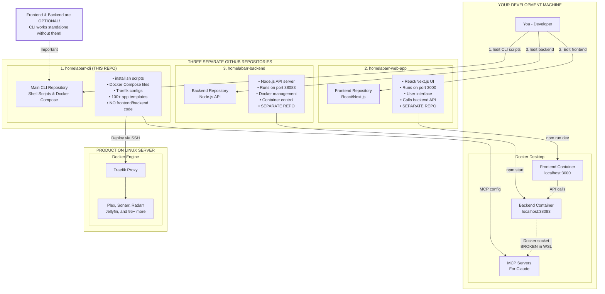

# HomelabARR Architecture - How 3 Repositories Work Together

## Visual Architecture Diagram



## Quick Summary

### What's in Each Repository:

1. **homelabarr-cli** (Current repository - where you are now)
   - The CORE product - fully functional standalone
   - All installation scripts
   - Docker Compose templates for 100+ applications
   - Traefik configuration
   - **NO frontend or backend code lives here**

2. **homelabarr-web-app** (Separate repository)
   - Optional web UI frontend
   - React/Next.js application
   - Runs on port 3000
   - Provides a graphical interface to manage the CLI

3. **homelabarr-backend** (Separate repository)
   - Optional API backend
   - Node.js server on port 38083
   - Bridges frontend with Docker
   - Manages containers programmatically

### Key Points:

- ✅ **CLI works perfectly on Linux** without any frontend/backend
- ✅ **Frontend/Backend are OPTIONAL** additions for web-based management
- ❌ **WSL Docker socket issue** only affects the optional web UI
- ✅ **Production servers** run the CLI standalone without issues

### File Locations:

```
F:\Coding Projects\
├── homelabarr-cli\          <-- YOU ARE HERE
│   ├── apps\                <-- Docker compose files
│   ├── traefik\             <-- Traefik configs
│   ├── scripts\             <-- Utility scripts
│   └── install.sh           <-- Main installer
│
├── homelabarr-web-app\      <-- SEPARATE REPO (Frontend)
│   ├── src\
│   ├── components\
│   └── package.json
│
└── homelabarr-backend\      <-- SEPARATE REPO (Backend)
    ├── src\
    ├── api\
    └── package.json
```

## View This Diagram

You can view this diagram in several ways:

1. **VS Code**: Install the "Markdown Preview Mermaid Support" extension
2. **GitHub**: This will render automatically when pushed to GitHub
3. **Online**: Copy the mermaid code to https://mermaid.live
4. **Generate PNG**: Run the Python script in this folder (requires `diagrams` package)

## Python Diagram Generator

To generate a high-quality PNG diagram:

```bash
# Install the diagrams package
pip install diagrams

# Run the generator
python generated-diagrams/create-architecture-diagram.py
```

This will create `homelabarr-architecture.png` in the generated-diagrams folder.