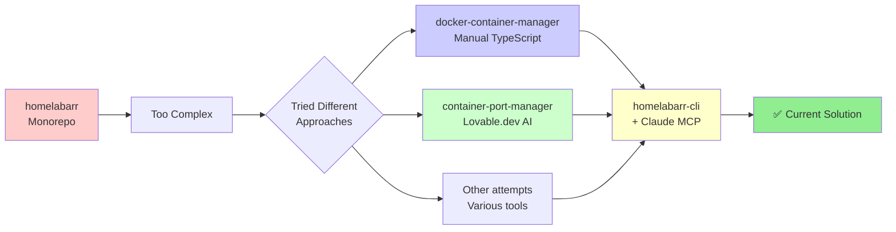

# HomelabARR Complete Ecosystem Documentation

## 🎯 The Journey to HomelabARR CLI

### Evolution of Approaches
1. **homelabarr** - Original monorepo (Frontend + Backend + API all-in-one)
2. **docker-container-manager** - Manual TypeScript/Express.js implementation
3. **container-port-manager** - Lovable.dev AI-generated React app (1,180 Docker downloads!)
4. **homelabarr-cli** - Current Claude MCP-powered solution ✅

## 📦 All HomelabARR Repositories

### Core Repositories

#### 1. homelabarr (Original Monorepo)
- **Type:** Full-stack monorepo
- **Stack:** React frontend + Node.js backend + REST API
- **Purpose:** Original all-in-one web application
- **Status:** Legacy - being split into separate concerns
- **URL:** https://github.com/smashingtags/homelabarr

#### 2. homelabarr-cli (Current Focus) 
- **Type:** CLI tool with MCP integration
- **Stack:** Shell scripts + Docker Compose + Claude MCP
- **Purpose:** Deploy and manage 100+ self-hosted applications
- **Features:** Traefik proxy, Authelia auth, Cloudflare integration
- **URL:** https://github.com/smashingtags/homelabarr-cli

#### 3. homelabarr-containers
- **Type:** Docker configurations repository
- **Contains:** Container configs, custom builds, templates
- **URL:** https://github.com/smashingtags/homelabarr-containers

### Support Repositories

#### 4. homelabarr-assets
- **Type:** Media and resources
- **Contains:** Images, logos, documentation assets
- **URL:** https://github.com/smashingtags/homelabarr-assets

#### 5. homelabarr-uploader
- **Type:** File upload service
- **Stack:** Node.js
- **Purpose:** Handle uploads and media processing
- **URL:** https://github.com/smashingtags/homelabarr-uploader

#### 6. homelabarr-site
- **Type:** Marketing/Documentation site
- **Stack:** Astro
- **Live:** https://homelabarr.com (Port 8087)
- **URL:** https://github.com/smashingtags/homelabarr-site

#### 7. local-persist ⚠️
- **Type:** Docker volume plugin
- **Language:** Go
- **Issue:** Needs rename to `homelabarr-local-persist`
- **URL:** https://github.com/smashingtags/local-persist

## 🚀 Container Management Projects

### docker-container-manager (Manual Build)
- **Type:** Web-based Docker management platform
- **Stack:** TypeScript, Express.js, Socket.io, SQLite, JWT
- **Architecture:**
  ```typescript
  class Application {
    private dockerService: DockerServiceImpl;
    private databaseService: DatabaseServiceImpl;
    private websocketService: WebSocketServiceImpl;
    private authService: AuthServiceImpl;
  }
  ```
- **Features:**
  - Full Docker API integration via Dockerode
  - Real-time WebSocket updates
  - SQLite database for persistence
  - JWT authentication
  - RESTful API endpoints
- **Inspiration:** Unraid-like management without fees
- **URL:** https://github.com/smashingtags/docker-container-manager

### container-port-manager (AI Generated)
- **Type:** React frontend application
- **Generator:** Lovable.dev AI
- **Stack:** 
  - React 18 + Vite
  - TypeScript
  - shadcn/ui components
  - Tailwind CSS
  - Lucide React icons
- **Success Metric:** 1,180 Docker Hub downloads! 🎉
- **Docker Image:** Available on Docker Hub
- **URL:** https://github.com/smashingtags/container-port-manager

## 📊 Comparison: Manual vs AI-Generated

| Aspect | docker-container-manager | container-port-manager |
|--------|-------------------------|----------------------|
| **Approach** | Manual TypeScript development | AI-generated (Lovable.dev) |
| **Type** | Backend-focused | Frontend-focused |
| **Stack** | Express.js + SQLite | React + Vite |
| **Docker Integration** | Direct API via Dockerode | UI-focused |
| **Real-time** | WebSocket support | React state management |
| **Database** | SQLite | None (frontend only) |
| **Auth** | JWT implementation | Not implemented |
| **Docker Downloads** | N/A | 1,180 |
| **Development Time** | Weeks/Months | Hours/Days |

## 🔄 The Evolution Story



## 🎯 Why HomelabARR CLI + Claude MCP Won

After trying multiple approaches:

1. **Monorepo (homelabarr)** - Too tightly coupled, hard to maintain
2. **Manual TypeScript (docker-container-manager)** - Too much boilerplate, slow development
3. **AI-Generated (container-port-manager)** - Good for UI but lacked deep integration
4. **Other tools** - Didn't provide the flexibility needed

**HomelabARR CLI + Claude MCP** provides:
- ✅ Rapid development with AI assistance
- ✅ Deep Docker integration via MCP
- ✅ Flexible scripting with Shell/Docker Compose
- ✅ Real-time collaboration with Claude
- ✅ Automated SDLC via Jira/Confluence MCP
- ✅ Version control and documentation built-in

## 📈 Success Metrics

- **container-port-manager**: 1,180 Docker downloads (AI-generated success!)
- **homelabarr-cli**: Active development with Claude MCP
- **Community**: Discord server with active users
- **Apps Supported**: 100+ self-hosted applications

## 🚀 Next Steps

1. Continue HomelabARR CLI development with Claude MCP
2. Consider integrating best parts of container-port-manager UI
3. Rename `local-persist` → `homelabarr-local-persist`
4. Document lessons learned from each approach

---

*"I tried all sorts of apps before I found you" - And that journey led to the perfect solution!*

*Generated: August 21, 2025*
*Location: F:\Coding Projects\homelabarr-cli*