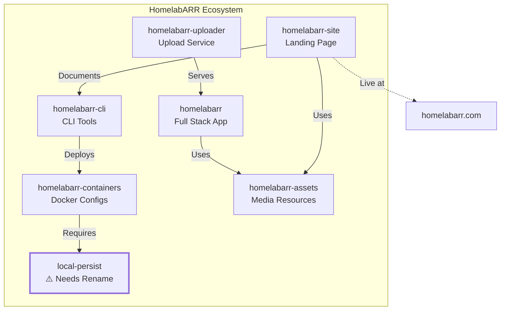

# HomelabARR Complete Repository Structure

## 🚀 All HomelabARR Repositories

### 1. **homelabarr** 
- **Type:** Original full-stack monorepo
- **Contains:** Frontend + Backend + API all in one repository
- **Purpose:** Complete web application for HomelabARR management
- **URL:** https://github.com/smashingtags/homelabarr

### 2. **homelabarr-cli** (THIS REPO - You are here!)
- **Type:** Standalone CLI tool
- **Contains:** Shell scripts, Docker Compose templates, Traefik configs
- **Purpose:** Deploy and manage 100+ self-hosted applications
- **URL:** https://github.com/smashingtags/homelabarr-cli

### 3. **homelabarr-containers**
- **Type:** Docker configurations repository
- **Contains:** Container configs, custom builds, Docker modifications
- **Purpose:** Centralized container management and templates
- **URL:** https://github.com/smashingtags/homelabarr-containers

### 4. **homelabarr-assets**
- **Type:** Media and resources repository
- **Contains:** Images, logos, documentation assets, UI resources
- **Purpose:** Shared assets across all HomelabARR projects
- **URL:** https://github.com/smashingtags/homelabarr-assets

### 5. **homelabarr-uploader**
- **Type:** File upload service
- **Contains:** Upload automation, media management, cloud integration
- **Purpose:** Handle file uploads and media processing
- **URL:** https://github.com/smashingtags/homelabarr-uploader

### 6. **homelabarr-site**
- **Type:** Marketing/Landing page (Astro)
- **Contains:** Static site, documentation, landing pages
- **Purpose:** Public-facing website and documentation
- **Live Site:** https://homelabarr.com
- **Docker Port:** 8087
- **URL:** https://github.com/smashingtags/homelabarr-site

### 7. **docker-container-manager** 
- **Type:** Web-based Docker management platform
- **Contains:** TypeScript/Express.js app store-like container manager
- **Purpose:** Unraid-like Docker management without fees (inspired by Perfect Media Server)
- **Features:** App store UI, real-time monitoring, WebSocket support, JWT auth
- **Stack:** TypeScript, Express, Socket.io, SQLite, Dockerode
- **URL:** https://github.com/smashingtags/docker-container-manager

### 8. **local-persist** ⚠️ (Needs Rename)
- **Type:** Docker volume plugin
- **Contains:** Persistent storage management for Docker volumes
- **Purpose:** Local data persistence for containers
- **Should be:** `homelabarr-local-persist` for consistency
- **URL:** https://github.com/smashingtags/local-persist

## 📊 Repository Relationships

## 🔧 Key Technologies by Repository

| Repository | Primary Language | Framework/Tools | Docker | Status |
|------------|-----------------|-----------------|--------|--------|
| homelabarr | JavaScript | React/Node.js | ✅ | Active |
| homelabarr-cli | Shell/Bash | Docker Compose | ✅ | Active |
| homelabarr-containers | YAML | Docker | ✅ | Active |
| homelabarr-assets | N/A | Static Files | ❌ | Active |
| homelabarr-uploader | JavaScript | Node.js | ✅ | Active |
| homelabarr-site | TypeScript | Astro | ✅ | Active |
| local-persist | Go | Docker Plugin | ✅ | Needs Rename |

## 📝 Action Items

1. ✅ All repositories follow `homelabarr-*` naming convention except one
2. ⚠️ Rename `local-persist` to `homelabarr-local-persist` for consistency
3. ✅ Live website running at https://homelabarr.com
4. ✅ Docker deployments available for most components

## 🌐 Live Resources

- **Website:** https://homelabarr.com
- **Discord:** https://discord.gg/Pc7mXX786x
- **Docker Hub:** https://hub.docker.com/u/smashingtags

---
*Generated: August 21, 2025*
*Location: F:\Coding Projects\homelabarr-cli*