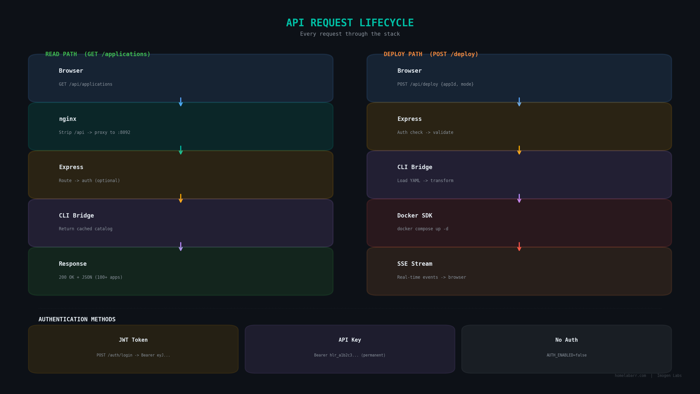

# API Reference

HomelabARR has a REST API for scripting, automation, and building integrations. Everything the dashboard does, the API can do too.

**Base URL:** `http://your-server:8092`
(or via the frontend proxy: `http://your-server:8084/api/`)



---

## Authentication

Most endpoints require a valid token or API key.

!!! info "Auth is required by default"
    When `AUTH_ENABLED=true` (the default), endpoints marked with * in the table below require authentication. Disabling auth removes login protection from the entire API — don't do this on a networked server. See the [Configuration guide](configuration.md) for details.

### Get a Token

```bash
curl -X POST http://your-server:8092/auth/login \
  -H "Content-Type: application/json" \
  -d '{"username": "admin", "password": "admin"}'
```

Response:
```json
{
  "token": "eyJhbGciOiJIUzI1NiIs...",
  "user": { "username": "admin", "role": "admin" }
}
```

!!! info "Token expiry"
    JWT tokens expire after a short time (controlled by your `JWT_SECRET` setup). For long-running scripts or automation, use API keys instead — they don't expire until you revoke them.

Use the token in all subsequent requests:

```bash
curl -H "Authorization: Bearer YOUR_TOKEN_HERE" http://your-server:8092/applications
```

### API Keys (Better for Scripts)

```bash
# Create an API key
curl -X POST http://your-server:8092/auth/api-keys \
  -H "Authorization: Bearer YOUR_TOKEN" \
  -H "Content-Type: application/json" \
  -d '{"name": "my-script"}'
```

Response:
```json
{
  "key": "hlr_a1b2c3d4...",
  "name": "my-script",
  "id": "abc123"
}
```

!!! warning "Save your API key"
    The full key is only shown once. If you lose it, delete it and create a new one.

Use it exactly like a token:

```bash
curl -H "Authorization: Bearer hlr_your_key_here" http://your-server:8092/applications
```

**Manage your keys:**

```bash
# List keys (names only — keys themselves are not re-displayed)
curl -H "Authorization: Bearer YOUR_TOKEN" http://your-server:8092/auth/api-keys

# Delete a key
curl -X DELETE -H "Authorization: Bearer YOUR_TOKEN" http://your-server:8092/auth/api-keys/KEY_ID
```

---

## App Catalog

```bash
# Get all available apps
curl http://your-server:8092/applications
```

Sample response:
```json
{
  "success": true,
  "data": [
    {
      "id": "media-servers-plex",
      "name": "Plex",
      "category": "media-servers",
      "image": "lscr.io/linuxserver/plex:latest",
      "description": "Plex Media Server"
    }
  ],
  "total": 123
}
```

---

## Deploy an App

```bash
curl -X POST http://your-server:8092/deploy \
  -H "Authorization: Bearer YOUR_TOKEN" \
  -H "Content-Type: application/json" \
  -d '{
    "appId": "media-servers-plex",
    "config": {
      "TZ": "America/New_York",
      "ID": "1000",
      "APPFOLDER": "/opt/appdata"
    },
    "mode": { "type": "standard" }
  }'
```

**Mode options:** `standard`, `traefik`, or `authelia`

Returns a `deploymentId`. Watch progress via SSE:

```bash
curl http://your-server:8092/stream/progress?deploymentId=YOUR_ID
```

---

## Manage Containers

```bash
# List all containers
curl -H "Authorization: Bearer YOUR_TOKEN" http://your-server:8092/containers

# With CPU/memory stats
curl -H "Authorization: Bearer YOUR_TOKEN" "http://your-server:8092/containers?stats=true"

# Start a container
curl -X POST -H "Authorization: Bearer YOUR_TOKEN" \
  http://your-server:8092/containers/CONTAINER_ID/start

# Stop a container
curl -X POST -H "Authorization: Bearer YOUR_TOKEN" \
  http://your-server:8092/containers/CONTAINER_ID/stop

# Restart a container
curl -X POST -H "Authorization: Bearer YOUR_TOKEN" \
  http://your-server:8092/containers/CONTAINER_ID/restart

# Remove a container
curl -X DELETE -H "Authorization: Bearer YOUR_TOKEN" \
  http://your-server:8092/containers/CONTAINER_ID

# View container logs
curl -H "Authorization: Bearer YOUR_TOKEN" \
  http://your-server:8092/containers/CONTAINER_ID/logs
```

---

## Check Ports

```bash
# All ports currently in use
curl http://your-server:8092/ports/check

# Find next available port in a range
curl "http://your-server:8092/ports/available?start=8000&end=9000"
```

---

## Health Check

```bash
curl http://your-server:8092/health
```

Returns `200` with `{"status": "healthy"}` when everything is running. Returns `503` if Docker isn't accessible (catalog-only mode).

---

## User Management (Admin Only)

```bash
# Create a new user
curl -X POST http://your-server:8092/auth/users \
  -H "Authorization: Bearer YOUR_TOKEN" \
  -H "Content-Type: application/json" \
  -d '{"username": "viewer", "password": "a-strong-password", "role": "user"}'

# List all users
curl -H "Authorization: Bearer YOUR_TOKEN" http://your-server:8092/auth/users
```

---

## Full Endpoint Reference

Endpoints grouped by function:

### Auth
| Method | Endpoint | Auth required | What it does |
|--------|----------|:---:|-------------|
| `POST` | `/auth/login` | No | Log in, get JWT token |
| `POST` | `/auth/logout` | Yes | Log out |
| `GET` | `/auth/me` | Yes | Get your profile |
| `POST` | `/auth/change-password` | Yes | Change password |
| `POST` | `/auth/users` | Admin | Create user |
| `GET` | `/auth/users` | Admin | List users |
| `POST` | `/auth/api-keys` | Yes | Create API key |
| `GET` | `/auth/api-keys` | Yes | List your API keys |
| `DELETE` | `/auth/api-keys/:id` | Yes | Delete an API key |

### Applications
| Method | Endpoint | Auth required | What it does |
|--------|----------|:---:|-------------|
| `GET` | `/applications` | No* | Full app catalog |
| `POST` | `/deploy` | Yes* | Deploy an app |
| `GET` | `/stream/progress` | No | Deployment events (SSE) |

### Containers
| Method | Endpoint | Auth required | What it does |
|--------|----------|:---:|-------------|
| `GET` | `/containers` | Yes* | List containers |
| `POST` | `/containers/:id/start` | Yes* | Start container |
| `POST` | `/containers/:id/stop` | Yes* | Stop container |
| `POST` | `/containers/:id/restart` | Yes* | Restart container |
| `DELETE` | `/containers/:id` | Yes* | Remove container |
| `GET` | `/containers/:id/logs` | Yes* | Container logs |

### Ports & System
| Method | Endpoint | Auth required | What it does |
|--------|----------|:---:|-------------|
| `GET` | `/ports/check` | No | Ports in use |
| `GET` | `/ports/available` | No | Find open port |
| `GET` | `/health` | No | Health check |

*\* When `AUTH_ENABLED=true` (the default). All endpoints open if auth is disabled.*

---

## Error Format

All errors return consistent JSON:

```json
{
  "error": "What went wrong",
  "details": "More specific information"
}
```

Common codes: `400` bad request, `401` not authenticated, `403` not authorized, `404` not found, `500` server error.
