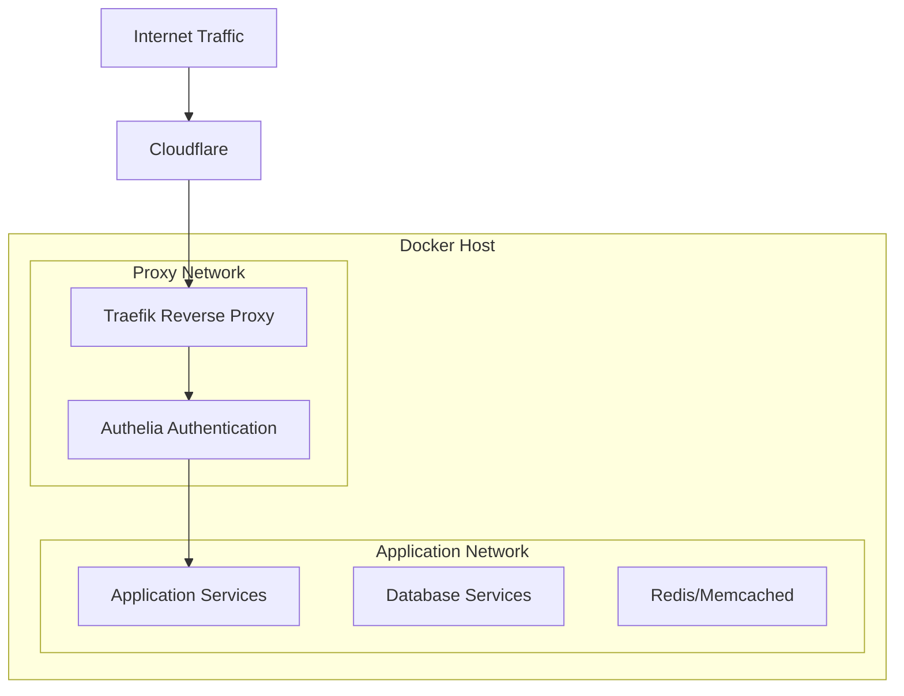
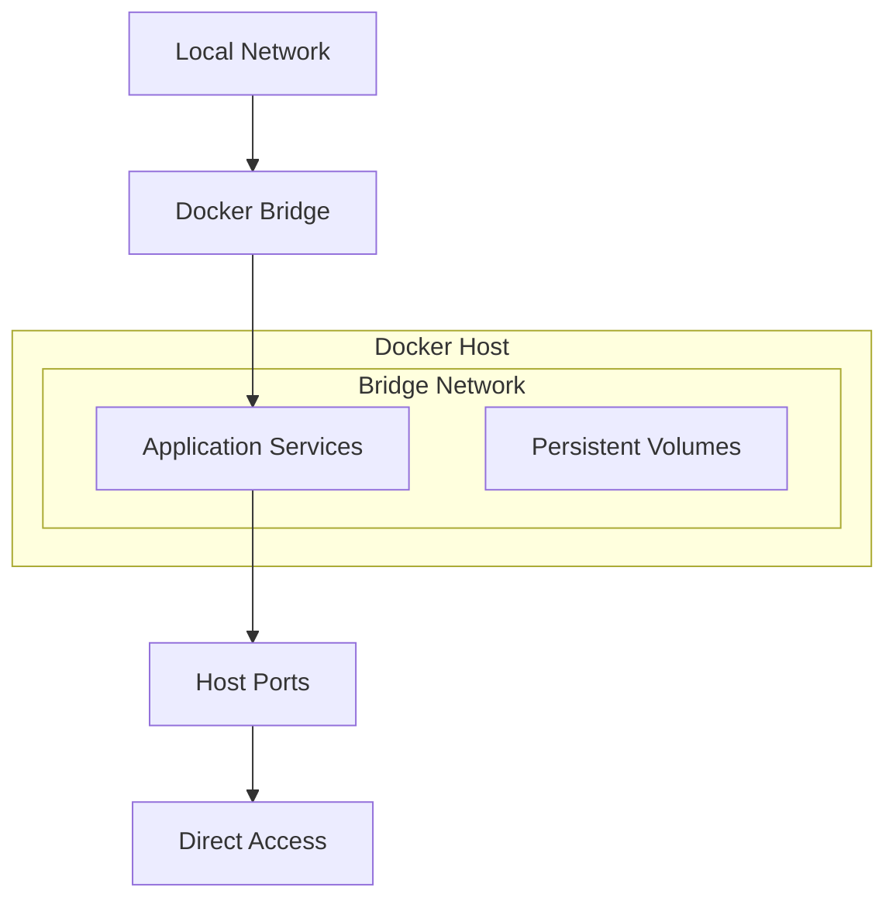
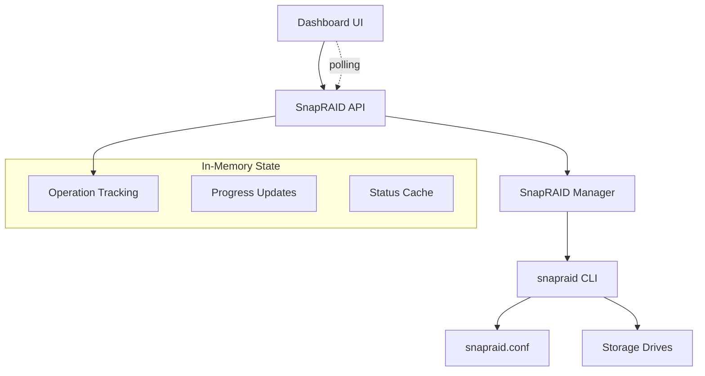
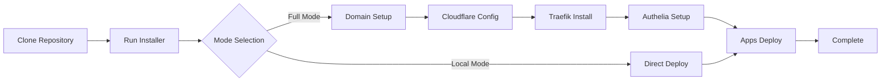

# HomelabARR CE - Architecture Documentation

## System Overview

HomelabARR CE is a containerized media server stack built on Docker with two distinct deployment architectures designed for different use cases.

## Core Architecture Principles

### Container-First Design
- **Microservices Architecture**: Each application runs in isolated containers
- **Immutable Infrastructure**: Applications are deployed as versioned container images
- **Configuration as Code**: All settings managed through Docker Compose YAML
- **Volume Persistence**: Data persistence through local-persist plugin or bind mounts

### Network Architecture

#### Full Mode (Production)


#### Local Mode (Development/Home Lab)


## Component Architecture

### Full Mode Components

#### Core Infrastructure
- **Traefik v3.x**: Reverse proxy with automatic service discovery
- **Authelia**: Authentication and authorization middleware
- **Cloudflare**: DNS management and DDoS protection
- **Let's Encrypt**: Automatic SSL certificate management

#### Application Categories
- **Media Servers**: Plex, Jellyfin, Emby
- **Media Management**: Radarr, Sonarr, Lidarr, Bazarr
- **Download Clients**: qBittorrent, SABnzbd, NZBGet
- **Request Management**: Overseerr, Petio
- **Monitoring**: Tautulli, Netdata, Uptime Kuma
- **Backup**: Duplicati, Restic
- **Storage Management**: SnapRAID integration (Professional Edition)

### Local Mode Components

#### Simplified Stack
- **Docker Compose**: Service orchestration
- **Bridge Networking**: Direct container communication
- **Port Mapping**: Host port exposure
- **Local-Persist**: Volume management plugin

## Data Flow Architecture

### Full Mode Data Flow
```
1. User Request → Cloudflare (DNS/DDoS)
2. Cloudflare → Traefik (SSL Termination)
3. Traefik → Authelia (Authentication)
4. Authelia → Application (Authorized Request)
5. Application → Storage (Data Persistence)
```

### Local Mode Data Flow
```
1. User Request → Docker Bridge Network
2. Bridge Network → Application Port
3. Application → Storage (Direct Access)
```

## Storage Architecture

### Volume Management
```
/opt/appdata/
├── plex/           # Plex media server data
├── radarr/         # Radarr configuration
├── sonarr/         # Sonarr configuration
├── qbittorrent/    # Download client data
└── overseerr/      # Request management
```

### SnapRAID Integration (Professional Edition)


**SnapRAID Features (Professional Edition):**
- **Drop-in Integration**: Seamless API compatibility
- **Real-time Progress**: Operation status and progress tracking
- **Cross-platform Support**: Windows development, Linux deployment
- **Simplified Architecture**: In-memory state management
- **Direct CLI Integration**: Native snapraid command execution

### Local-Persist Integration
```yaml
volumes:
  app-data:
    driver: local-persist
    driver_opts:
      mountpoint: /opt/appdata/application
```

## Security Architecture

### Full Mode Security Layers
1. **Cloudflare WAF**: Web Application Firewall
2. **Traefik TLS**: Transport Layer Security
3. **Authelia RBAC**: Role-Based Access Control
4. **Container Isolation**: Docker security boundaries
5. **Network Segmentation**: Isolated Docker networks

### Local Mode Security
1. **Network Trust**: Assumes trusted local network
2. **Container Isolation**: Docker security boundaries
3. **Host Firewall**: Traditional iptables/ufw protection

## Deployment Architecture

### Installation Process


### Configuration Management
- **Environment Variables**: Centralized in `.env` files
- **Template System**: Jinja2 templates for dynamic configuration
- **Version Control**: Git-based configuration tracking
- **Automated Setup**: Script-based installation and updates

## Application Integration Patterns

### Service Discovery
```yaml
labels:
  - "traefik.enable=true"
  - "traefik.http.routers.app.rule=Host(`app.domain.com`)"
  - "traefik.http.services.app.loadbalancer.server.port=8080"
```

### Authentication Integration
```yaml
labels:
  - "traefik.http.middlewares.authelia.forwardauth.address=http://authelia:9091/api/verify?rd=https://auth.domain.com"
  - "traefik.http.routers.app.middlewares=authelia"
```

## Monitoring Architecture

### System Monitoring
- **Container Health**: Docker health checks
- **Resource Usage**: Netdata/Glances integration
- **Service Uptime**: Uptime Kuma monitoring
- **Log Aggregation**: Centralized logging

### Application Monitoring
- **Media Server Analytics**: Tautulli for Plex
- **Download Monitoring**: Built-in client dashboards
- **Request Tracking**: Overseerr analytics

## Backup Architecture

### Data Backup Strategy
```
Source: /opt/appdata/
Targets:
  - Local: External drives
  - Cloud: S3/GCS/Azure
  - Remote: SFTP/rsync
```

### Configuration Backup
- **Docker Compose Files**: Version controlled
- **Environment Variables**: Encrypted storage
- **Application Configs**: Automated export

## Scalability Considerations

### Horizontal Scaling
- **Load Balancing**: Traefik automatic discovery
- **Database Clustering**: External database support
- **Storage Scaling**: Network-attached storage

### Vertical Scaling
- **Resource Limits**: Container resource management
- **Performance Tuning**: Application-specific optimization
- **Hardware Requirements**: CPU/Memory/Storage guidance

## Migration Architecture

### HomelabARR CE to HomelabARR CE
```
1. Data Assessment → Backup Creation
2. Service Mapping → Configuration Translation
3. Network Update → Label Standardization
4. Testing Phase → Parallel Deployment
5. Cutover → DNS/Traffic Switch
```

### Version Upgrades
- **Rolling Updates**: Zero-downtime container updates
- **Configuration Migration**: Automated config updates
- **Rollback Capability**: Previous version restoration

## Development Architecture

### Container Development
- **Multi-arch Builds**: AMD64/ARM64 support
- **Continuous Integration**: GitHub Actions
- **Registry Management**: GHCR.io hosting
- **Security Scanning**: Vulnerability assessment

### Documentation as Code
- **MkDocs**: Static site generation
- **Version Control**: Git-based documentation
- **Automated Building**: CI/CD pipeline
- **Search Integration**: Full-text search

## Future Architecture Evolution

### Planned Enhancements
- **Kubernetes Support**: Container orchestration expansion
- **CLI Modernization**: Go/Bubble Tea interface
- **API Integration**: RESTful management interface (Professional Edition)
- **Observability**: Enhanced monitoring and tracing
- **Storage Management**: Advanced SnapRAID configuration UI
- **WebSocket Updates**: Real-time operation updates

### GitHub Organization Migration
```
Current: smashingtags/homelabarr-ce
Future:  homelabarr/*
  ├── homelabarr/cli
  ├── homelabarr/containers
  ├── homelabarr/docs
  └── homelabarr/infrastructure
```

## Performance Optimization

### Container Optimization
- **Image Layering**: Minimal base images
- **Resource Allocation**: Efficient CPU/memory usage
- **Network Optimization**: Reduced latency routing
- **Storage Optimization**: Fast I/O patterns

### Application Tuning
- **Database Optimization**: Query performance
- **Caching Strategies**: Redis/Memcached integration
- **CDN Integration**: Static asset delivery
- **Compression**: Traffic optimization

---

**Architecture maintained by the HomelabARR development team.**  
**Last updated:** August 25, 2025 - SnapRAID Integration Complete
