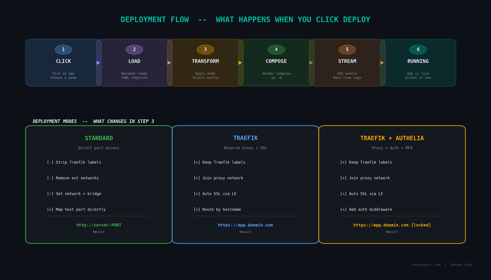
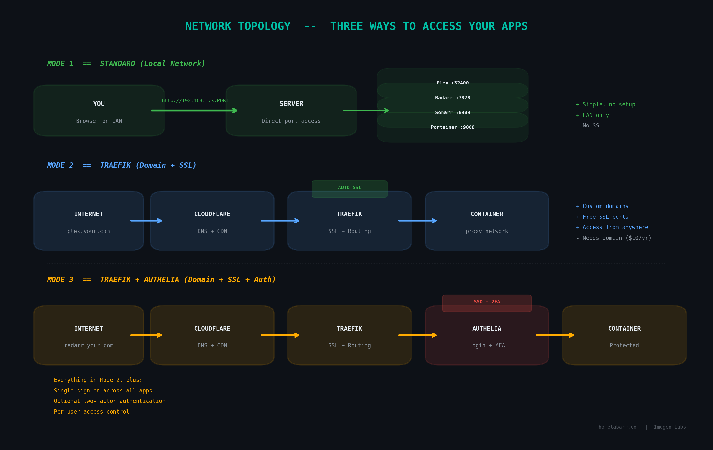

# Architecture

!!! info "You don't need to read this"
    This page is for developers and curious people. If you just want to use HomelabARR, the [Quick Start](quick-start.md) and [Web Dashboard](web-dashboard.md) guides have everything you need.

---

## The Big Picture

HomelabARR is two containers working together:


**Frontend** = what you see in your browser. It's a React app served by nginx.

**Backend** = what does the work. It reads app templates, talks to Docker, handles login, and streams deployment progress to the frontend.

**App templates** = standard Docker Compose YAML files in the `apps/` folder. The backend reads them; you deploy them with one click.

---

## How Deployment Works



When you click Deploy, here's what happens step by step:

1. You pick an app and a mode (Standard, Traefik, or Traefik + Authelia)
2. Frontend sends a request to the backend: "deploy Plex in standard mode"
3. Backend loads the Plex YAML template from `apps/media-servers/plex.yml`
4. If Standard mode: strips out Traefik labels and external networks
5. Fills in your settings (timezone, data path, user ID, etc.)
6. Runs `docker compose up -d`
7. Streams the Docker output back to your browser in real time
8. Done — your app is running

---

## Network Modes Explained



**Standard:** Your app binds to a port. You access it at `http://server:PORT`. Simple. No setup, works immediately.

**Traefik:** Your app joins the `proxy` network. Traefik reads Docker labels and routes traffic by hostname, with automatic SSL. You get URLs like `https://jellyfin.yourdomain.com`.

**Traefik + Authelia:** Same as above, but Authelia sits between Traefik and your app, requiring login with optional two-factor authentication.

---

## Where Data Lives

```
/opt/appdata/           # Your apps' data (configs, databases, media indexes)
├── plex/
├── radarr/
├── sonarr/
└── ...

homelabarr-data/        # Docker volume — HomelabARR's own settings (users, sessions)
```

Back up `/opt/appdata/` and you've backed up everything important.

---

## Tech Stack

| Component | Technology |
|-----------|-----------|
| Frontend | React 19, shadcn/ui, Vite |
| Backend | Node.js, Express |
| Container management | Docker SDK (via socket) |
| Authentication | JWT tokens, `hlr_` API keys |
| Deployment streaming | Server-Sent Events (SSE) |
| Container images | [LinuxServer.io](https://linuxserver.io) and official images |
| CI/CD | GitHub Actions → GitHub Container Registry |
| Hosting | Your server, your hardware, your rules |

---

## App Template Images

The majority of our app templates use [LinuxServer.io](https://linuxserver.io) container images (`lscr.io/linuxserver/*`). These are well-maintained, regularly updated, and follow a consistent pattern with `PUID`/`PGID` environment variables for file permissions.

We're a proud sponsor of LinuxServer.io. If you appreciate what they do, [consider supporting them too](https://www.linuxserver.io/donate).

---

## CI/CD Pipeline

Code goes through a 3-step process:

```
dev branch → staging branch (1-week soak test) → main branch (production)
```

When code is pushed to `main`, GitHub Actions automatically:
1. Builds new Docker images for frontend and backend
2. Pushes them to GitHub Container Registry
3. Deploys the wiki to GitHub Pages

If you're running HomelabARR with Watchtower, it auto-updates when new images are published.
