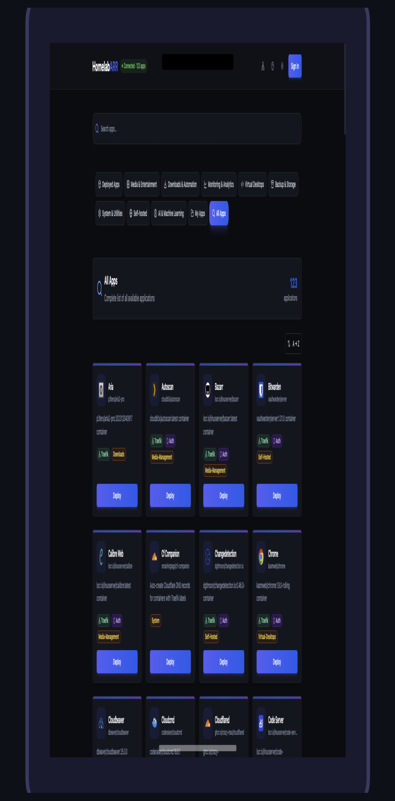
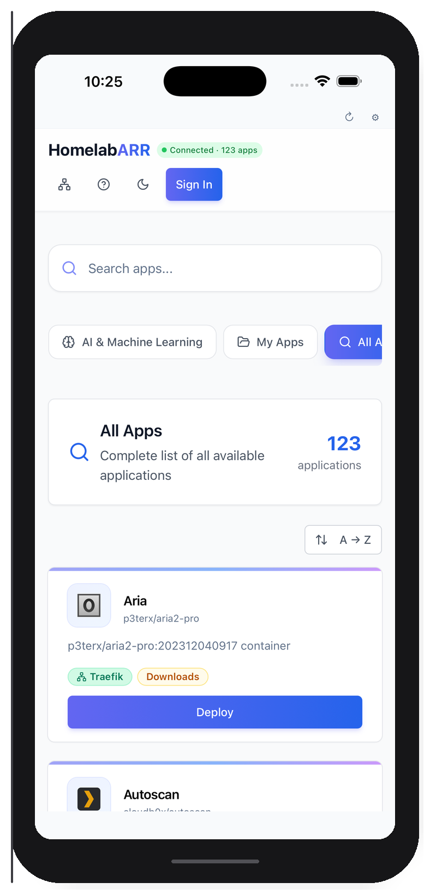

# Mobile App

HomelabARR Mobile is an optional companion app for iOS and Android. It connects to your existing CE server — same dashboard, same 110+ apps, same login — but native on your phone.

!!! info "The mobile app is optional"
    It doesn't run any extra backend services. Your CE server keeps running exactly as it does now. The app is just a convenient way to check on things without opening a laptop.

{ width="300", align="left" }
{ width="300" }

## What It Does

- **Browse and deploy** all 110+ container templates from your phone
- **Monitor** running containers with real-time status
- **Works everywhere** — local IP, Tailscale, Cloudflare Tunnel, any URL that reaches your CE server
- **Secure** — your server URL and API key are stored locally on your device. Deleting the app removes them.

## Getting It

| Platform | Status | Price |
|---|---|---|
| **iOS** (App Store) | TestFlight beta available | $4.99 one-time |
| **Android** (Google Play) | APK available, Play Store submission pending | $4.99 one-time |
| **Build from source** | Always free | [github.com/smashingtags/homelabarr-mobile](https://github.com/smashingtags/homelabarr-mobile) |

!!! info "Why $4.99?"
    HomelabARR CE is free and always will be. The mobile app is a convenience — compiled, signed, auto-updated through the store. Power users can always build it from the open source repo.

## Setup

When you first open the app, enter two things:

### 1. Your Server URL

This is whatever URL you use to access CE in a browser:

| Your setup | Example URL |
|---|---|
| Local network | `http://192.168.1.100:8084` |
| Tailscale | `http://100.x.x.x:8084` |
| Traefik + domain | `https://homelabarr.yourdomain.com` |
| Cloudflare Tunnel | `https://homelabarr.yourdomain.com` |

!!! warning "Local IPs only work on the same network"
    If you're away from home (on cellular or a different WiFi), a local IP like `192.168.1.100` won't work. You'll need Tailscale, a Cloudflare Tunnel, or a public domain pointed at your server for remote access.

### 2. Your API Key

Generate one from the CE dashboard: click your username → **API Keys** → **Generate New Key**. Copy the `hlr_` key and paste it into the app.

!!! warning "Revoke unused keys"
    API keys give full access to your CE instance. If you stop using a device, revoke its key from the dashboard — Settings → API Keys → Delete.

### 3. Tap Connect

The app validates the URL, checks the connection, and loads your dashboard.

---

## Troubleshooting

### "Connection failed"

- Is your CE server running? Check: `docker ps | grep homelabarr`
- Can your phone reach the URL? Try it in your phone's browser first
- On cellular or away from home? You need Tailscale or a public URL — local IPs only work on the same network

### Dashboard loads but shows "Failed to load applications"

- Your CE backend container might not be running: `docker ps | grep backend`
- If you're using an API key, check that it's valid in the dashboard

---

## Technical Details

- **Built with:** React Native + Expo
- **Storage:** Server URL and API key stored on-device via AsyncStorage — not sent anywhere
- **Platforms:** iOS 15+ and Android 10+
- **Source:** [github.com/smashingtags/homelabarr-mobile](https://github.com/smashingtags/homelabarr-mobile)

## Try the Demo

Don't have a CE server yet? Connect to the live demo:

- **URL:** `https://ce-demo.homelabarr.com`
- **Login:** `admin` / `admin`

Browse all 110+ apps (deploys are disabled on the demo server).
