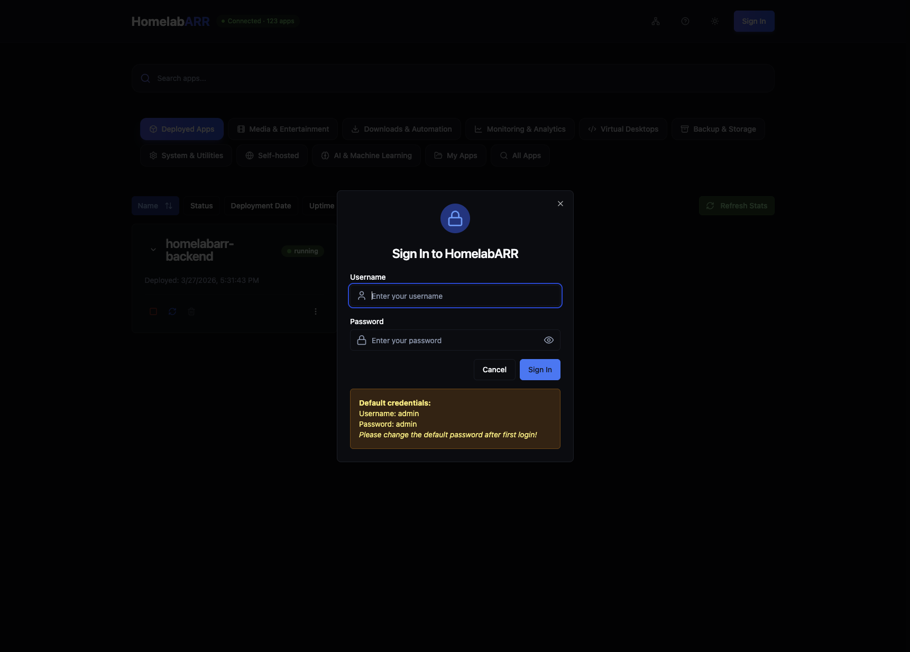
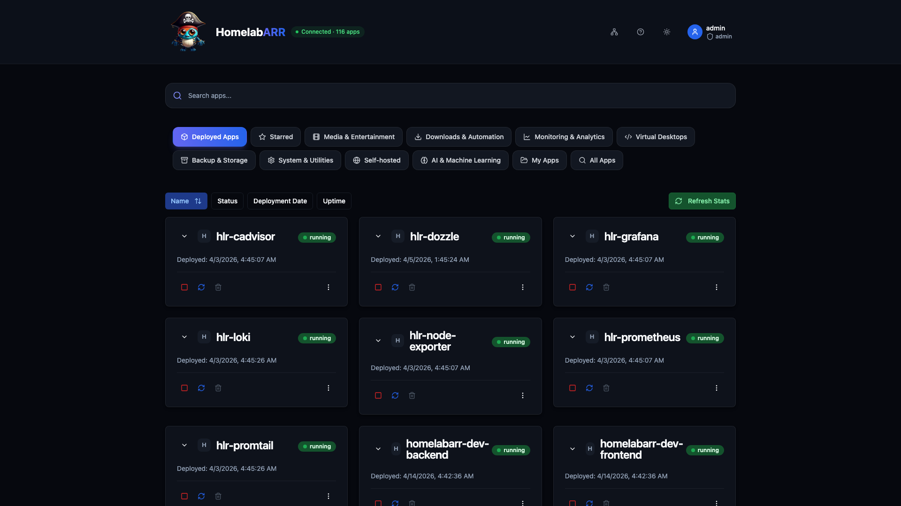

# Quick Start

Get HomelabARR CE running in under 5 minutes.

## Prerequisites

- A Linux server (Ubuntu 22.04+, Debian 12+, or similar)
- Docker 24.0+ with Docker Compose v2
- 4 GB RAM, 2 CPU cores, 20 GB disk (x86_64 or ARM64)

```bash
# Verify Docker is installed
docker --version
docker compose version
```

## Method 1: Docker Compose (Recommended)

This pulls pre-built images from GitHub Container Registry. No build step needed.

```bash
# Download the production compose file
curl -O https://raw.githubusercontent.com/smashingtags/homelabarr-ce/main/homelabarr.yml

# Set required environment variables
export JWT_SECRET=$(openssl rand -hex 32)
export DOCKER_GID=$(getent group docker | cut -d: -f3)

# Optional: Set your CORS origin if accessing from a domain
export CORS_ORIGIN=http://your-server-ip:8084

# Start HomelabARR
docker compose -f homelabarr.yml up -d
```

!!! warning "CORS_ORIGIN is important"
    If you see API errors after login, set `CORS_ORIGIN` to the URL you use to access the dashboard. For local access: `http://your-server-ip:8084`. For domain access: `https://homelabarr.yourdomain.com`.

### What gets deployed

| Container | Port | Purpose |
|-----------|------|---------|
| `homelabarr-frontend` | 8084 | Web dashboard (nginx) |
| `homelabarr-backend` | 8092 | REST API server (Node.js) |

### First login

1. Open `http://your-server-ip:8084`
2. Click **Sign In**
3. Username: `admin` / Password: `admin`
4. **Change the default password** under user settings



### Deploy your first app

1. Browse the app catalog or use the search bar
2. Click **Deploy** on any app
3. Choose a deployment mode:
    - **Standard** — direct port access (http://server:port)
    - **Traefik** — reverse proxy with SSL (requires [Traefik setup](traefik-setup.md))
    - **Traefik + Authelia** — reverse proxy with SSO/MFA
4. Configure environment variables (timezone, paths, etc.)
5. Click **Deploy** and watch the real-time progress



---

## Method 2: CLI Installation

For users who prefer a terminal-based setup with an interactive menu:

```bash
# Download and run the installer
sudo wget -qO /usr/local/bin/homelabarr-cli \
  https://raw.githubusercontent.com/smashingtags/homelabarr-ce/main/install-remote.sh
sudo chmod +x /usr/local/bin/homelabarr-cli

# Run the interactive installer
homelabarr-cli -i
```

The CLI installer will:

1. Clone the HomelabARR CE repository
2. Set up environment variables
3. Configure Docker networks
4. Present an interactive menu to deploy applications

!!! tip "CLI vs Web Dashboard"
    The CLI and web dashboard are complementary. The CLI installs the underlying Docker Compose templates; the web dashboard provides a GUI for the same catalog. You can use both.

---

## Method 3: Build from Source

For developers who want to modify the code:

```bash
# Clone the repository
git clone https://github.com/smashingtags/homelabarr-ce.git
cd homelabarr-ce

# Install dependencies
cd client && npm install && cd ..
cd server && npm install && cd ..

# Start in development mode
# Terminal 1: Backend
cd server && npm run dev

# Terminal 2: Frontend
cd client && npm run dev
```

The frontend runs on port 5173 (Vite dev server) and proxies API requests to the backend on port 8092.

---

## Next Steps

- [Web Dashboard Guide](web-dashboard.md) — learn the full UI
- [Configuration](configuration.md) — environment variables and settings
- [Traefik & Domain Setup](traefik-setup.md) — access apps via custom domains with SSL
- [API Reference](api-reference.md) — automate deployments via REST API

---

## Troubleshooting

### "CORS error" or API calls failing after login

Set the `CORS_ORIGIN` environment variable to match exactly how you access the dashboard:

```bash
# Example for IP access
export CORS_ORIGIN=http://192.168.1.100:8084
docker compose -f homelabarr.yml up -d

# Example for domain access  
export CORS_ORIGIN=https://homelabarr.yourdomain.com
docker compose -f homelabarr.yml up -d
```

### Containers won't deploy — "Docker socket" error

The backend needs access to the Docker socket. Ensure:

1. `/var/run/docker.sock` is mounted in the backend container (it is by default in `homelabarr.yml`)
2. `DOCKER_GID` matches your host's Docker group ID: `getent group docker | cut -d: -f3`

### Permission denied on `/opt/appdata`

```bash
sudo mkdir -p /opt/appdata
sudo chown -R 1000:1000 /opt/appdata
```

### Running in Proxmox LXC

If deploying inside a Proxmox LXC container, you may need to disable AppArmor:

```bash
# On the Proxmox host, edit the LXC config:
# /etc/pve/lxc/<VMID>.conf
lxc.apparmor.profile: unconfined
```

Then restart the LXC container.
