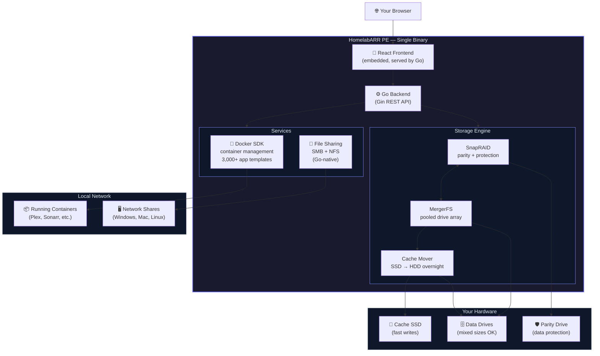

# HomelabARR Professional Edition

!!! warning "PE is in active development"
    HomelabARR PE is real and functional, but it's not ready for paying customers yet. Core features (SnapRAID + MergerFS storage, file sharing, container management) are working. We're in the final polish phase before opening up purchases.

    **Early Adopter pricing is available** for people who want to support the project and lock in the lowest price while it's in development. You'll get access as soon as we open the beta.

    Sign up for updates at [homelabarr.com](https://homelabarr.com).

---

HomelabARR PE is a **NAS management platform** — not just an app launcher. It includes everything in CE (Docker container management, 3,000+ app templates) plus enterprise-grade storage management built for homelabs running mixed-size drives.

If CE is "deploy apps on my server," PE is "manage my homelab NAS *and* deploy apps on it."

---

## What's Different from CE

| Feature | CE (Free, MIT) | PE (Paid, Proprietary) |
|---------|:---:|:---:|
| Docker container management | ✅ | ✅ |
| 3,000+ app templates | ✅ | ✅ |
| Traefik/Authelia scaffolding | ✅ | ✅ |
| Web dashboard | ✅ | ✅ enhanced |
| **Storage management (SnapRAID + MergerFS)** | ❌ | ✅ |
| **Mixed drive support (any sizes)** | ❌ | ✅ |
| **Cache mover** | ❌ | ✅ |
| **Native file sharing (SMB/NFS)** | ❌ | ✅ |
| **Single binary install** | ❌ | ✅ |
| Source code | Open (MIT) | Closed source |
| Support | Community Discord | Priority |

**Key difference:** CE manages Docker containers. PE manages your entire storage infrastructure — the drives, parity, cache — and then deploys Docker containers on top of it.

---

## Who PE Is For

PE is aimed at homelab users running a media server setup with:

- Multiple drives of mixed sizes (different capacities is fine — SnapRAID handles it)
- A need for data protection without the cost of a full RAID card
- File sharing over the local network (Samba/NFS) to other devices
- Cache drives for fast writes that get moved to spinning rust overnight

If you're running a single server with a few drives and mostly care about Docker app deployment, CE is probably enough. PE adds value when you want the storage layer managed too.

---

## Architecture

PE ships as a **single binary** — no Docker required to run PE itself (though it manages Docker for your app deployments):

??? tip "How to read this diagram"
    Boxes are components, arrows show what talks to what. Everything inside the purple border ships as a single binary — you run one file, and all of it starts up together.

Here's what each layer does:

1. **Your browser** connects to the PE web dashboard — same idea as CE, just more tabs
2. **React frontend** is embedded directly in the binary. No separate nginx container needed
3. **Go backend** is the brain — it handles API requests, auth, and coordinates everything below it
4. **Storage Engine** is what makes PE different from CE:
    - **SnapRAID** protects your data with a parity drive — if a drive dies, you recover it
    - **MergerFS** pools all your drives into one big folder, even if they're different sizes
    - **Cache Mover** writes fast to your SSD first, then moves files to spinning drives overnight
5. **Docker SDK** manages your containers — same 3,000+ app templates as CE
6. **File Sharing** serves SMB (Windows) and NFS (Linux/Mac) shares natively — no Samba container required
7. At the bottom: your actual hardware — cache SSD, data drives (mixed sizes are fine), and one parity drive

---

## Can I Run CE and PE on the Same Server?

PE is a superset — it ships with everything CE does. There's no need to run both. If you're running CE now and upgrade to PE, your containers, Docker Compose configs, and `/opt/appdata/` data all carry over.

---

## Pricing

All tiers are **one-time purchases**, no subscription:

| Tier | Price | What you get |
|------|-------|-------------|
| **Early Adopter** | $19 | Lifetime access at the lowest price — for backers supporting development |
| **Starter** | $39 | PE binary + dashboard + container management (up to 8 drives) |
| **Pro** | $79 | Unlimited drives + all storage features + 1 year of updates |
| **Lifetime** | $149 | Everything in Pro + lifetime updates + priority support |

!!! info "Early Adopter note"
    The Early Adopter tier is for people who believe in the project and want to support it while it's being built. You get lifetime access once PE launches. Pricing will go up when we hit general availability.

→ [Purchase at homelabarr.com](https://homelabarr.com){ .md-button .md-button--primary }

---

## Stay Updated

- **[Discord](https://discord.gg/Pc7mXX786x)** — #announcements for PE release news
- **[homelabarr.com](https://homelabarr.com)** — product page and purchase
- **[GitHub](https://github.com/smashingtags/homelabarr-ce)** — star the CE repo for notifications
